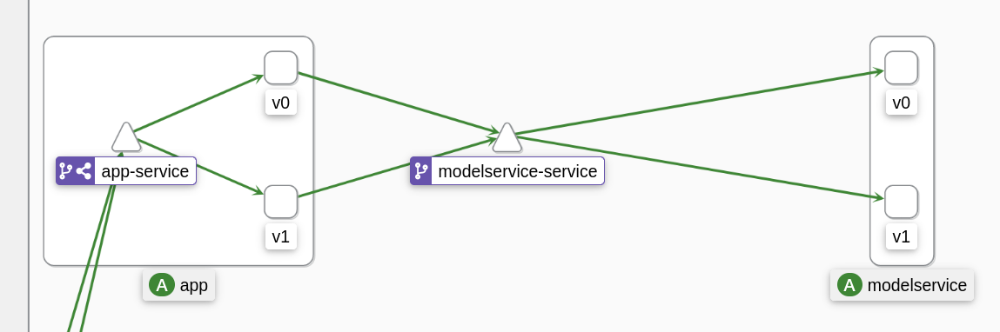

# Restaurant review sentiment predictor

1. [Continuous experimentation](#continuous-experimentation-a3)
2. [Run the app (A2)](#run-the-app-a2)
    * [Docker compose](#docker-compose)
    * [Helm chart](#helm-chart)
3. [App](#app)
4. [Model service](#model-service)
5. [Prometheus](#prometheus)
6. [Grafana](#grafana)

## Continuous experimentation (A3)

The Helm Chart has been modified to deploy a continuous experimentation environment in Kubernetes using Istio. To use the older instructions for assignment 2, go to the `a2` tag. The old instructions will not work with the new Helm chart.

### Prerequisites
Install Istio in the Kubernetes cluster.

### Install

To run the app, simply run the following in the chart folder:

```sh
# Add prometheus repo if not added
helm repo add prometheus-community https://prometheus-community.github.io/helm-charts

# Update dependencies of the chart
helm dependency build

# Install
helm install [RELEASE_NAME] .
```
### Experiment - Incremental training

The experiment we want to perform with a continuous experimentation system is to see if we can improve the classifier with online learning. We will collect reviews with feedback submitted to the app, and send them using a button in the history panel. The research question we aim to answer is:

**Will the accuracy of the model increase if we incorporate the feedback received through the app?**

To do this, we deploy a stable and experimental versions of the `app` and `model-service`:

- The experimental `app` includes a button "Incremental training", that sends every review and feedback received to the model through a REST endpoint. Sent feedback is marked, so it is not sent again.

- The experimental `model-service` includes a new endpoint, that receives a list of feedback, that includes text, prediction and correctnes. Then, it uses this data to further train the model.

The following image shows the Istio architecture, where `v0` indicates the stable version,  and `v1` the experimental version:


The different users are assigned to one of the versions with the following rules:

- If the HTTP request contains a cookie `ce-version=v0` or `ce-version=v1`, the user is redirected to the `v0` or `v1` deployment.

- If the HTTP request does not contain this cookie, or if it has a different value, the user is randomly directed to `v0` or `v1`, each with a 50% chance. Istio adds a header indicating the choice, and this is intercepted by the `app`, which will set the correspondent cookie in the response, so the version is fixed in subsequent requests.

If you want to test one version or the other, it is recommended to manually set the cookie in the browser inspector.

During this experiment, we monitor accuracy scores of both versions, which is obtained from user feedback. If our hypothesis is correct, we should see that the average accuracy of the experimental version should increase with time, given enough review samples and feedback.

## Run the app (A2)

### Docker compose

To run the app, simply run `docker compose up` to deploy both the `app` and `model-service` container. The frontend interface is available in http://localhost:8080/

### Helm chart
We provide a Helm chart that automatically deploys the app and the Prometheus stack through the dependency `kube-prometheus-stack`

To run the app, simply run the following in the chart folder:

```sh
# Add prometheus repo if not added
helm repo add prometheus-community https://prometheus-community.github.io/helm-charts

# Update dependencies of the chart
helm dependency build

# Install
helm install [RELEASE_NAME] .
```

If you use Minikube to run the app, simply open a `minikube tunnel`. The app frontend will be available in http://localhost/, and the Grafana dashboards in http://localhost/grafana (see [Grafana](#grafana))

Consult the `values.yaml` file to see the configurable values, specially those related to alerting capabilities.

## App
The [webapp](https://github.com/remla23-team10/app) is a simple Spring app with two endpoints:

- The root path `/` that serves an static HTML/JS page
- The `/sentiment` [endpoint](https://github.com/remla23-team10/app/blob/main/src/main/java/nl/tudelft/remla/team10/app/controllers/SentimentController.java), that receives a review and delegates the prediction to the `model-service` through a HTTP API request.

To locate the `model-service` API, an URL with host and post is loaded as a environment variable to the `app` container, through the `docker-compose` properties.

## Model-service
The [model-service](https://github.com/remla23-team10/model-service) is a simple Flask REST API in Python, which loads the previously trained model in [model-training](https://github.com/remla23-team10/model-training)

- The [preprocessing.py](https://github.com/remla23-team10/model-service/blob/main/preprocessing.py) file contains a class that loads the Bag of Words vectorizer and abstract preprocessing logic from the main REST app. This file is copied from `mode-training`.

- The binaries for the model and the vectorizer are loaded from URL, hardcoding the url of the RAW file from Github (e.g. https://github.com/remla23-team10/model-training/raw/main/Classifier_Sentiment_Model).


## Prometheus
Prometheus is included in the deployment as a monitoring service. To see which app-specific metrics are being monitoring, check the [webapp](https://github.com/remla23-team10/app) README file.

Our configuration also includes a Prometheus alert that fires in case of an increased rate of negative feedback in 1 minute (wrong predictions, see `templates/alertrules.yaml`). You can receive email notifications about alerts by configuring the email receiver in `values.yaml`.

## Grafana

Grafana is automatically deployed along with Prometheus using the [kube-prometheus-stack](https://github.com/prometheus-community/helm-charts/blob/main/charts/kube-prometheus-stack) chart.
* Grafana is available on http://localhost/grafana. 
* User (admin) and password (prom-operator) are defaults according to the [values](https://github.com/prometheus-community/helm-charts/blob/main/charts/kube-prometheus-stack/values.yaml) of the original chart. They can be changed on our `values.yaml`.
* Putting any dashboards (JSON format) in "remla23-team10-restaurant/dashboards" will automatically import them into Grafana on deployment.